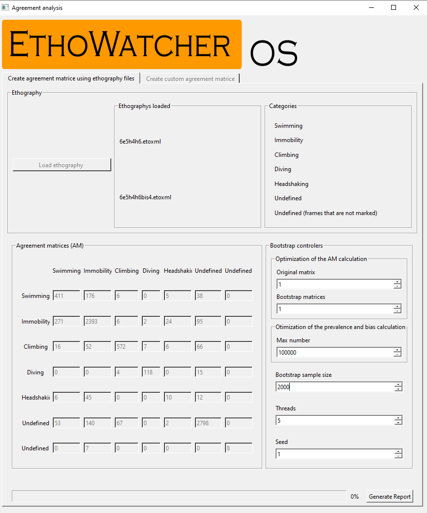

# Reliability tools
Here, we propose algorithms for the calculation of Cohen’s K and associated measures (Kmax, Prevalence or P,and Bias or B) of behavioral ratings, aimed to estimate and evaluate inter- and intra-HO reliability for all and each of the recorded behavioral categories.

# DATA ANALYSIS  TOOLS: Intra- and inter observers reliability analysis

Interface to reliability analysis from transcriptions produced int [EthoWatcher-OS](ethowatcher.com)

## Load ethography button
Clique nesse botão para carregar a etografia desejada, repita esse passo novamente para carregar a segunda etografia. Na sequência, dirija-se aos controladores da análise bootstrap.

## Controladores da análise de bootstrap
Use essa seção para ajustar alguns parâmetros importantes, configurar e otimizar o tempo necessário para realizar a análise de bootstrap. Na sequência, clique no botão “Generate report”

### Divisor da matriz máxima medida
Ajuste esse valor para aumentar a velocidade no calculo da matriz de concordância máxima do catalogo, quanto maior o número maiores as divisões de valores nas células, veja uma previa do resultado em “Agreement table”. 

-TIP: Ajuste para que os valores nas células sejam menores sem ser igual 0. O tempo de processamento é valor de cada célula multiplicado.

### Divisor da matriz máxima usada durante a análise de bootstrap.
 
Ajuste esse valor para aumentar a velocidade do cálculo da matriz de concordância máxima do catalogo durante a técnica de bootstrap, quanto maior o número maiores as divisões de valores nas células, veja uma previa do resultado em “Agreement table”.

### Quantidade máxima de combinações para a análise de viés e prevalência
Ajuste o máximo de combinações exploradas pelo calculo de viés e prevalência regulando esse número. 

### Quantidade de amostras feitas pelo método de bootstrap
Ajuste a quantidade de amostras do modelo

### Quantidade de tarefas
Ajuste a quantidade de processamento requisitado durante a análise de bootstrap para o computador. CUIDADO, o programa pode usar 100% do CPU e trava-lo.

### Seed usado no gerador de dados do bootstrap
Ajuste a semente usada no gerador de dados do bootstrap, esse parâmetro serve para que o resultado possa ser reproduzido. 

## Generate report
Clique nesse botão para executar as rotinas de análise de concordância das etografias carregadas e produzir um relatório com os resultados. 

# Library
This program was develop with QT librarys and C++ 11, report are generate using a python script.